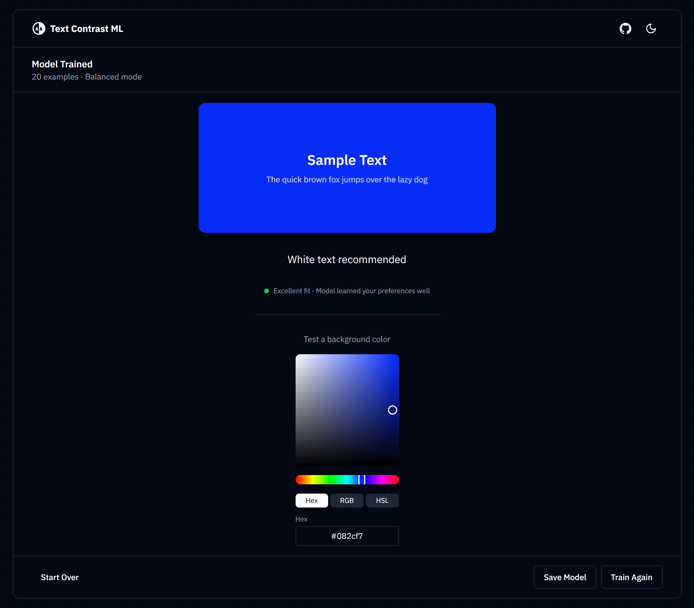

<div align="center">
    <a href="https://nathan-abela.github.io/Text-Contrast-ML">
        
    </a>

# Text Contrast ML

Train a neural network to predict optimal text color for any background. Runs entirely in your browser.

[](https://nextjs.org)
[](https://www.typescriptlang.org)
[](https://tailwindcss.com)
[](https://brain.js.org)


</div>

## Live Demo

Check out the live site at **[nathan-abela.github.io/Text-Contrast-ML](https://nathan-abela.github.io/Text-Contrast-ML)**

<p align="center">
    
</p>

## Features

- **Interactive training** - Label background colors with your preferred text color (black or white)
- **Client-side ML** - Neural network trains directly in your browser using Brain.js
- **Instant predictions** - Test any color and see the model's recommendation
- **Save models** - Store up to 5 trained models in browser storage
- **Training quality indicator** - See how well your model learned based on loss and example count
- **No backend** - All processing happens locally, no data leaves your device

## How It Works

1. **Train** - You're shown random background colors. Pick whether black or white text is easier to read.
2. **Learn** - The neural network learns patterns from your choices.
3. **Predict** - Pick any color and the model predicts the best text color.

For technical details, visit the [Learn page](https://nathan-abela.github.io/Text-Contrast-ML/learn).

## Getting Started

1. **Clone the repository:**

   ```bash
   git clone https://github.com/nathan-abela/Text-Contrast-ML.git
   ```

2. **Install dependencies:**

   ```bash
   npm install
   ```

   > **Note:** The `.npmrc` file skips native compilation for Brain.js. No Python or C++ build tools needed. See [troubleshooting.md](troubleshooting.md) if you encounter issues.

3. **Start the development server:**

   ```bash
   npm run dev
   ```

4. **Open your browser:**

   Navigate to [http://localhost:3000](http://localhost:3000)

## Technologies Used

- [Next.js](https://nextjs.org) - React framework with static export
- [TypeScript](https://www.typescriptlang.org) - Type safety
- [Tailwind CSS](https://tailwindcss.com) - Utility-first styling
- [shadcn/ui](https://ui.shadcn.com) - UI components
- [Brain.js](https://brain.js.org) - Client-side neural networks

---

<p align="center">
    
</p>
